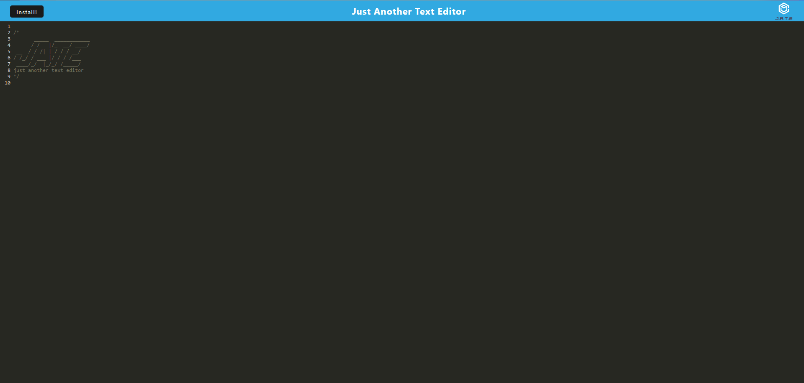

# 19-PWA-text-editor
      
## [Description](#table-of-contents)
A progressive text editor web app. This app uses service worker, manifest file and webpack, with the database being stored in local storage. Users can click install to download the web app to use on desktop

[Heroku Deployed Link](https://gentle-badlands-65970-562e8346df93.herokuapp.com/)

## Table-of-Contents
* [Description](#description)
* [Installation](#installation)
* [Usage](#usage)
* [License](#license)
* [Contributing](#contributing)
* [Tests](#tests)
* [FAQs](#faqs)
   
## [Installation](#table-of-contents)
download and run npm i, or access using the deployed heroku link
   
## [Usage](#table-of-contents)
There are 3 package.json files, so all three must be initialized and run so that all of the dependencies can be installed. 
       
## [license](#table-of-contents)

Your repository is licensed under an mit open source license, so other people can contribute more easily.More information can be found by clicking this [link.](https://choosealicense.com/licenses/mit)

## [Contributing](#table-of-contents)
If you want to:
* Suggest a feature
* Report an issue
* Improve documentation
* Contribute to the code

Contact or fork repo
   
GitHub [issues page](https://github.com/katyn-sh/19-PWA-text-editor/issues) 
   
## [Tests](#table-of-contents)
n/a
   
## [FAQs](#table-of-contents)
Contact Information:

[GitHub](https://github.com/katyn-sh) / Email: tanhung.huynh@protonmail.ch